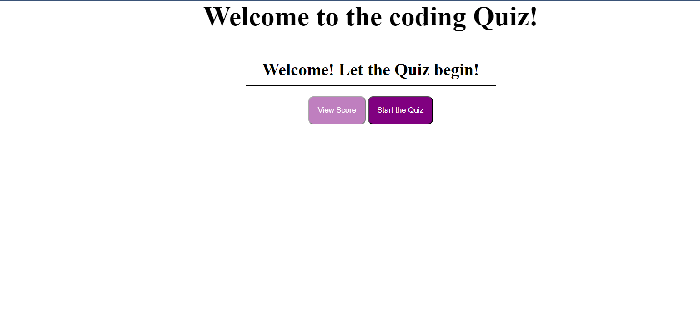

# My-Coding-Quizzes

## Description

A webpage that generates a list of coding-related multiple choice questions. The user will be given a score base on the number of questions they answer correctly. The user will also be able to log down their score on the scoreboard

## Installation

N/A

## Usage 

User are able to use this as an study guide in an fun entertaining way. With the ability to keep track of the score

## Credits

Villy
GreatStack https://youtu.be/PBcqGxrr9g8?si=5El54u3OYv5L1SqI

## Deployed Page

## License

Please refer to the github page